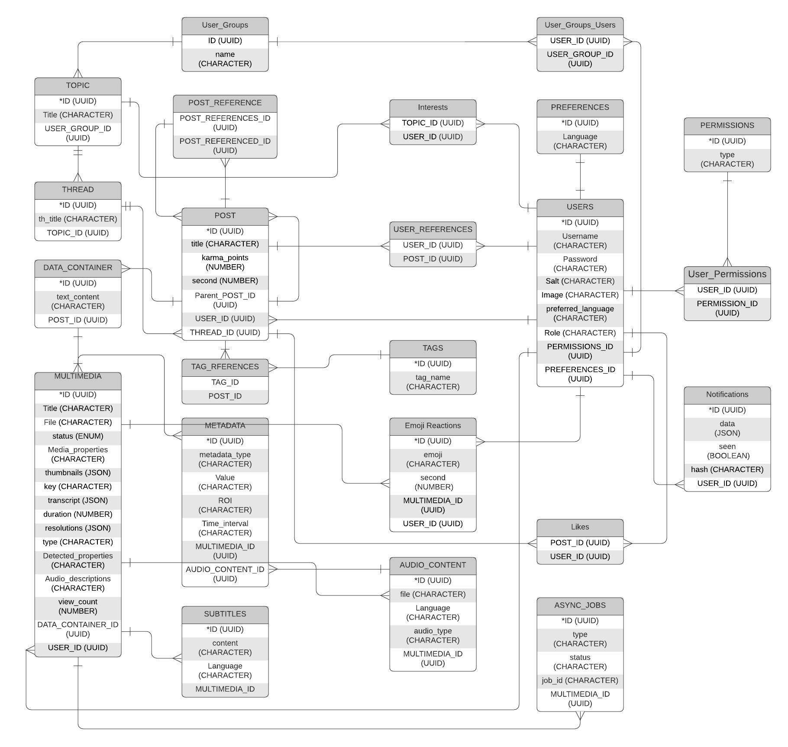

# Data Base

## Description

In this document is discrived a relational database.  The physical design was build with PostgreSQL. To build it in Node.js, it's used an ORM library (Sequelize) in order to manage better all data in the base data.

## ERD (Entity Relationship Diagram)

## Models

All models are in models folder. There is a class called [DataBase](index.ts) that is charge of build all the database (models and relationships between them) and synchronice with physical database. The API will take an instance of this object to do the operations with the database.

The database models are the next one:

[Users](users.ts)

[Multimedia](multimedia.ts)